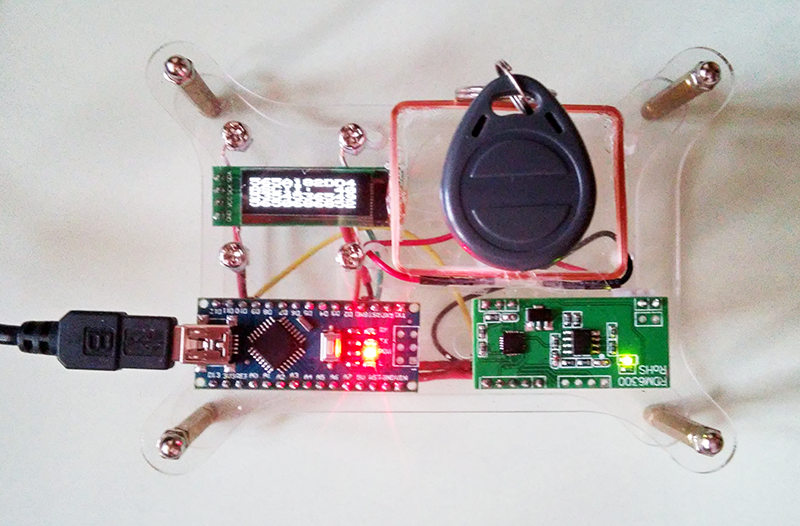

# EM-Marin reader

EM-Marin reader (EM4100 and EM4102) on Arduino, RDM6300 and OLED.

Spectrum analyzer on Arduino Nano and TI CC2500+PA+LNA with SPI and/or I2C OLED's SSD1306. The spectral width is 2400.01–2503.40 MHz with spacing in 405.456543 kHz on two SPI displays. Displays logo on I2C display. This scheme takes less then 50mA (on 5V).

## Equipment

1. Arduino Nano v3.0 or Mini Pro (with 3.3V)
2. RDM6300 ([fritzing part](../fritzing-scheme/RDM6300.fzpz)) with external antenna
3. OLED 0.91" 128×32 I2C SSD1306

## Displays and CC2500+PA+LNA Module

Connect OLED and RDM6300 to Arduino Nano as shown on the picture.

## Arduino Nano

Install [Adafruit GFX](https://github.com/adafruit/Adafruit-GFX-Library) and [Adafruit SSD1306](https://github.com/adafruit/Adafruit_SSD1306) libraries in Arduino IDE. This scanner based on [Test sketch for RFID module RDM6300 125 kHz](http://forum.arduino.ua/viewtopic.php?id=345) (Russian) written by Yojeh (Йожэг).

## Connection Map

| Arduino Nano | RDM6300       |
| ------------ | ------------- |
| D10          | Tx            |
| 5V           | 5V            |
| GND          | GND           |

| Arduino Nano | I2C OLED      |
| ------------ | ------------- |
| A5 (19)      | SCK           |
| A4 (18)      | SDA           |
| 3V3          | VCC           |
| GND          | GND           |

And also connect ANT1 and ANT2 to external antenna (without polarity).

## Implementation

Prototype is assembled in a clear acrylic case for Raspberry Pi, but can be built more compactly.